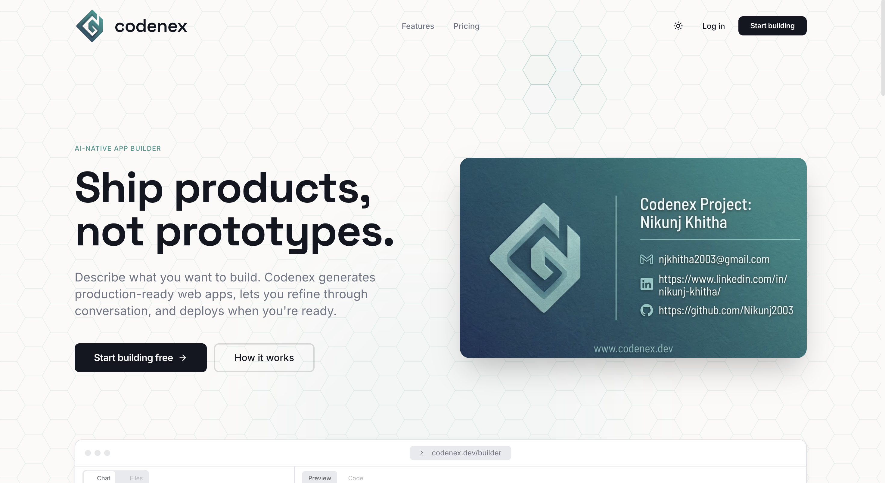
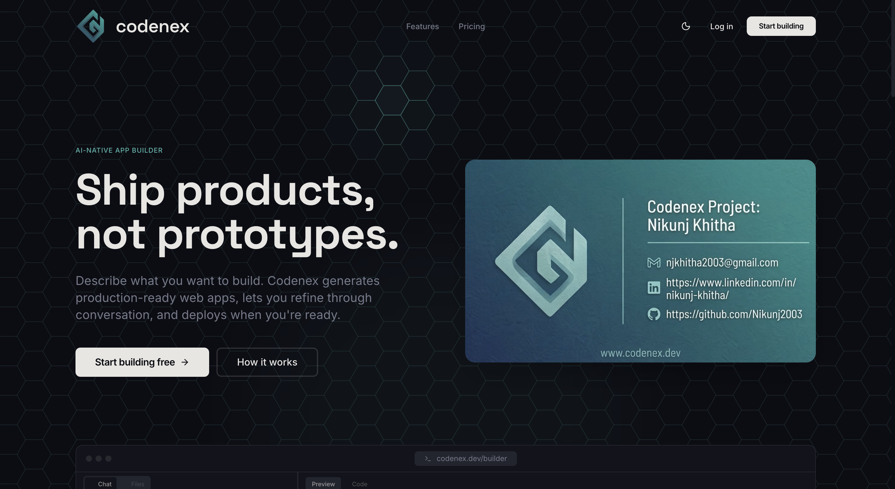
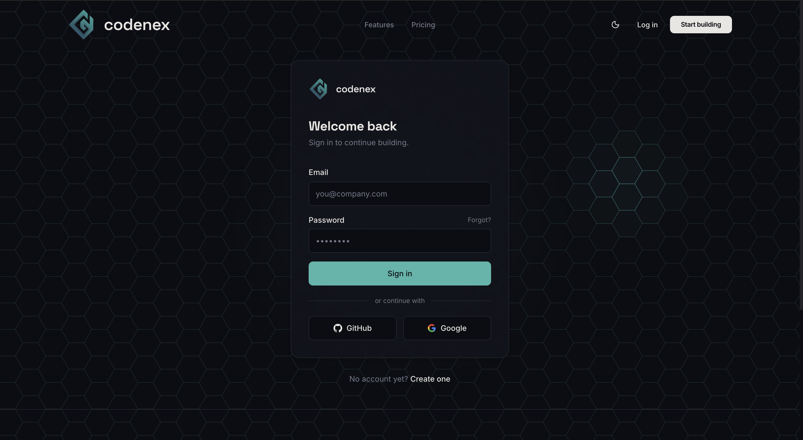
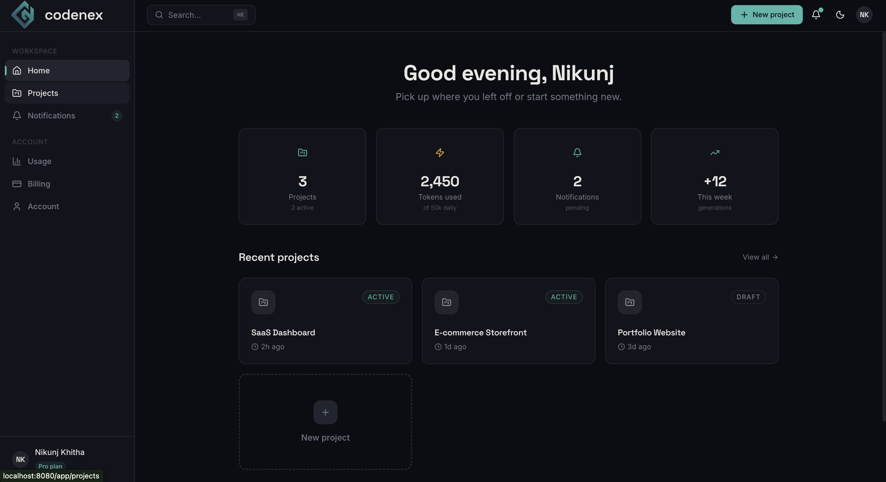
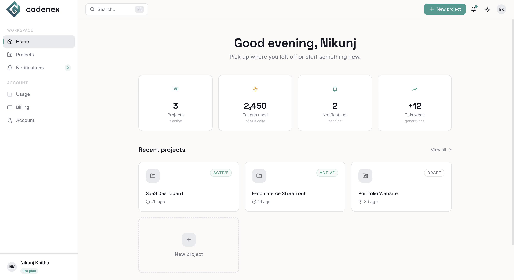
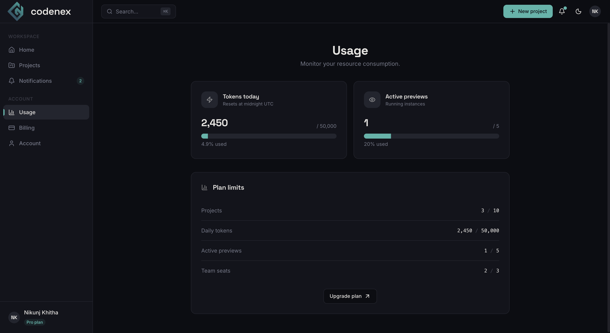
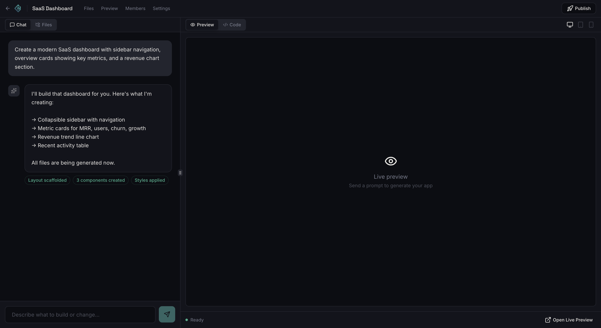

# Codenex Studio Frontend

Frontend for **Codenex Studio**, an AI-powered website and app builder. This repository contains the product-facing UI for the marketing site, authentication flows, dashboard, project management views, builder workspace, preview flows, and account/billing surfaces.

## Overview

Codenex Studio is designed around an AI-assisted product workflow:
- describe what you want to build,
- iterate through conversational refinement,
- inspect generated project structure and previews,
- manage projects, collaborators, billing, and account settings from a unified frontend.

This codebase currently focuses on the frontend experience and product surface area. Many flows are represented with polished UI and mock interaction states, making the repository suitable as a frontend foundation for a broader microservice-based platform.

## Current product surfaces

Based on the route structure in `src/App.tsx`, the app currently includes:

## Screenshots

### Landing page

**Light theme**



**Dark theme**



### Authentication

**Login page**



### Dashboard

**Overview — dark theme**



**Overview — light theme**



**Usage page**



### Builder workspace



### Public site
- Landing page
- Features page
- Pricing page
- Login page
- Signup page

### Authenticated app
- Dashboard
- Projects listing
- Project overview
- Project files
- Project preview
- Project members
- Project settings
- Notifications
- Usage
- Billing
- Account

### Builder workflow
- Dedicated builder workspace at `/app/projects/:projectId/builder`
- Chat/generation panel UI
- Preview/code tabs
- File/browser style panels
- Device preview controls

## Tech stack

- Vite
- React 18
- TypeScript
- React Router
- TanStack React Query
- Tailwind CSS
- shadcn/ui + Radix UI
- Framer Motion
- Vitest + Testing Library

## Local development

### Prerequisites
- Node.js
- npm or Bun

### Install dependencies

Using npm:

```sh
npm install
```

Using Bun:

```sh
bun install
```

### Start the development server

Using npm:

```sh
npm run dev
```

Using Bun:

```sh
bun run dev
```

## Available scripts

Using npm:

```sh
npm run dev
npm run build
npm run build:dev
npm run preview
npm run lint
npm run test
npm run test:watch
```

Using Bun:

```sh
bun run dev
bun run build
bun run build:dev
bun run preview
bun run lint
bun run test
bun run test:watch
```

## Project structure

```text
src/
  components/      Shared app and UI components
  layouts/         Public and authenticated layout shells
  pages/           Route-level screens
  providers/       Cross-cutting React providers like theme handling
  lib/             Shared utilities
  hooks/           Reusable hooks
public/            Static assets and branding files
```

## Key frontend architecture

- `src/App.tsx` wires global providers and the full route tree.
- `src/layouts/PublicLayout.tsx` wraps the marketing/auth pages.
- `src/layouts/AppLayout.tsx` provides the authenticated shell.
- `src/providers/ThemeProvider.tsx` manages light/dark theme persistence.
- `src/components/ui/*` contains the reusable design-system primitives.

## Scope notes

This repository is strongest as a frontend product foundation. The UX and route architecture are significantly developed, while some product workflows currently use mocked or local UI state rather than fully integrated backend services.

## Roadmap-friendly extension areas

Natural next steps for this frontend include:
- real authentication and session wiring,
- live project and builder APIs,
- deployment/preview integrations,
- collaborative activity and notification backends,
- usage, billing, and account service integration.

## License

This project is licensed under the MIT License. See [`LICENSE`](./LICENSE) for details.

## Publishing notes

Before pushing publicly, verify:
- local-only tooling files are excluded,
- the preferred package manager workflow is documented,
- build, lint, and tests pass,
- repository metadata and screenshots/assets reflect the current product branding.
